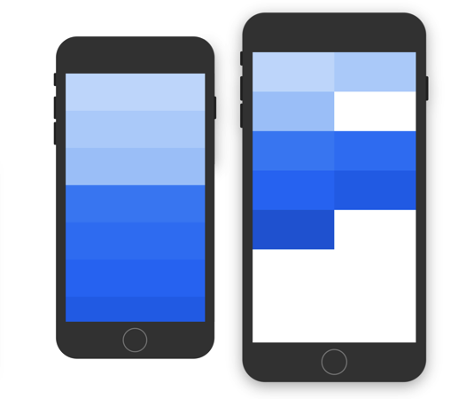
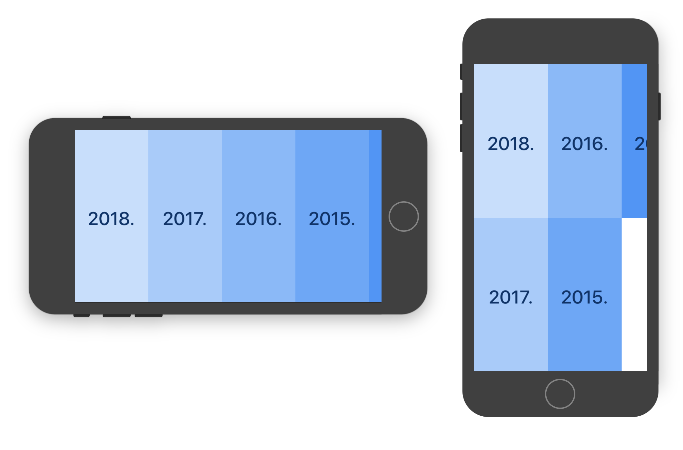
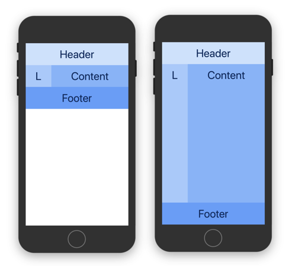

# react-native-responsive-layout

Set of components and utilities that make building responsive RN user interfaces easy by bringing concepts used on the web.

## Installation

This package is only **compatible with RN>=42**, as older versions do not support percentage-based widths.  
To install the latest version simply run:

```bash
yarn add react-native-responsive-layout
```
or if you prefer using `npm`:
```bash
npm install --save react-native-responsive-layout
```

## Responsive layout

Even though React-Native offers a great way to build complex native applications fast, building responsive UI still isn't as easy as on the web. With RN42, things got drastically better when percentage based widths landed. Still building responsive applications is quite hard without introducing many conditional renderings, this framework aims to bring many concepts we are used to on web to simplify native development.

The most important concept these components bring is **ability to specify different component sizes and to select styles depending on viewport size** to enable responsive making building responsive elements as easy as using Bootstrap grid.

It is built to be **mobile first**, so grid collapses to largest size class that it fits. This way you don't need to define sizes/styles for all breakpoint sizes, rather you can implement only those that matter and it will fallback to the first smaller one that it fits. For example, you can define only `xsSize` and `lgSize`, on all sizes lower than large it will fallback to extra small, but on all larger it will pick large one. This gives you the flexibility to target most device sizes quite precisely.

## Examples

### Responsive elements

Any element that contains multiple different size classes will act responsive and adapt its size. Lets see how can we implement *single column design on typical phones and two columns on larger ones*. 

When rendering it will render largest size class that is smaller or equal to the determined device size. Since design is mobile first, it doesn't matter if you use `size` or `xsSize`, since overriding it with larger size (eg. `xlSize` for tablets) would have the same effect, they coexist for semantical reasons -- when size is fixed across all size classes it makes more sense to use just `size`.

```jsx
<Grid>
  <Section>
    <Block xsSize="1/1" smSize="1/2" /> {/* 1.1 */}
    <Block xsSize="1/1" smSize="1/2" /> {/* 1.2 */}
    <Block xsSize="1/1" smSize="1/2" /> {/* 1.3 */}
  </Section>
  <Section>
    <Block size="1/1" smSize="1/2" /> {/* 2.1 */}
  </Section>
</Grid>
```

In order to better show how it works, this [example](examples/1-responsive-elements.js) has sections marked with red border and each block is colored and has numbering.



You can also see how columns are placed next to each other until they reflow to new line, when needed you can **break into new row manually using another section**.


### Hidden elements

Sometimes we only want to display specific elements on larger or smaller devices, to do that we can use hidden classes (eg. `mdHidden`).

In this [example](examples/2-hidden-elements.js) we will hide two elements from first section on larger phones, and only show element from the second section on smaller phones.

Again since grid is mobile first it will be hidden on specified and larger device sizes. This means that in order to hide elements on larger devices it is enough to just define `smHidden` and they won't be displayed on larger devices. But in order to element to be hidden on only smaller devices we need to define it is hidden on small and then override it on larger.

```jsx
<Grid>
  <Section>
    <Block />          {/* 1.1 */}
    <Block smHidden /> {/* 1.2 */}
    <Block smHidden /> {/* 1.3 */}
  </Section>
  <Section>
    <Block xsHidden smHidden={false} /> {/* 2.1 */}
  </Section>
</Grid>
```


### Shifting elements

Sometimes we need to align element in center or push it to the right, you can do it by adding filler `Block` elements to ensure reflow on each design, but the simplest way to do it is using auto width elements, they will use flex to fill the space.

To keep element on the **left** and keep remaining space free, simply put next element into new section. To **center** element add stretching element before and after given element. To shift it to the **right**, just add one before.


```jsx
<Grid>
  <Section>
    <Block xsSize="1/2" smSize="1/4"></Block> {/* Left */}
  </Section>
  <Section>
    <Block size="auto" />
    <Block xsSize="1/2" smSize="1/4"></Block> {/* Center */}
    <Block size="auto" />
  </Section>
  <Section>
    <Block size="auto" />
    <Block xsSize="1/2" smSize="1/4"></Block> {/* Right */}
  </Section>
  <Section>
    <Block xsSize="1/3" smSize="1/4"></Block> {/* Left */}
    <Block size="auto" />
    <Block xsSize="1/3" smSize="1/4"></Block> {/* Right */}
  </Section>
</Grid>
```

Just like in this [example](examples/3-shifting-elements.js), normally when using stretching elements you will want to **put items from same line into separate section**, since they have no way of knowing when you want to break into next line.


### Fixed size elements

Usually sometimes we need elements with static size as well. In this example we are going to combine both fixed size elements, responsive elements and stretching elements at the same time.

Following [example](examples/4-fixed-size-elements.js) shows just that.

```jsx
<Grid>
  <Section>
    <Block style={{ width: 100 }} />    {/* Fixed */}
    <Block size="auto" />
    <Block xsSize="1/2" smSize="2/3" /> {/* Responsive */}
  </Section>
</Grid>
```


### Conditionally rendering different styles or components

When we render content depending on device size, often we want to also style some parts of components conditionally as well. In order to make it more easier there is HOC available that you can wrap your component with that will provide selector function which will select appropriate values.

For [example](examples/5-conditional-styling.js), if we want to render components using different styles we can wrap our component using `withSizeClass` and use `sizeSelector` prop to select appropriate style or even a component -- this way we can even render completely different component depending on size.


```jsx
const WrappedComponent = withSizeClass(({ sizeSelector }) => {
  const style = sizeSelector({
    xs: styles.lightContent,
    sm: styles.darkContent,
  });

  return (
    <View style={style} />
  );
});
```

```jsx
<Grid>
  <Section>
    <Block>
      <WrappedComponent />
    </Block>
  </Section>
</Grid>
```


### Layout content either horizontally or vertically

Just by changing `direction` prop we can select in which direction layout should flow. 
Keep in mind when doing it that breakpoints are based on device height rather than width since most common use case for horizontal flow is in landscape orientation where again device height is greater concern.

```jsx
<Grid direction="horizontal">
  <Section>
    <Block xsSize="1/1" smSize="1/2" /> {/* 1.1 */}
    <Block xsSize="1/1" smSize="1/2" /> {/* 1.2 */}
    <Block xsSize="1/1" smSize="1/2" /> {/* 1.3 */}
  </Section>
  <Section>
    <Block size="1/1" smSize="1/2" />   {/* 2.1 */}
  </Section>
</Grid>
```



### Stretching grid

By default grid size will be based on the content size, if you want it to stretch available space, simply set `stretch` property on grid, it will set appropriate styles on child `Box` and `Section` components and enable their children to be properly rendered using flex.

In this case by default both `Grid` and `Section` will be configured with `flex: 1` which you can override by providing custom style to any of those components. This way you can tweak size ratios of different elements.

```jsx
<Grid stretch>
  {/* This ensures grid sections and blocks are configured to stretch. */}

  <Section style={{ height: 80, flex: 0 }}>
    {/* Since by default Sections would stretch we need to override their flex
    style in order for them to stay fixed height. */}
    <Block />
  </Section>
  <Section>
    <Block size="1/4" />  {/* L */}
    <Block size="auto" /> {/* Content */}
  </Section>
  <Section style={{ height: 80, flex: 0 }}>
    <Block />
  </Section>
</Grid>
```



Keep in mind that when rendering components using flex inside ScrollView, you should set `{ flex: 1 }` as `contentContainerStyle` prop in order for it to stretch entire space. For complete examples take a look at source for above [normal](examples/7-stretch-disabled.js) and [stretching](examples/7-stretch-enabled.js) examples.


## Size Classes

Sizing is mobile first so it renders depending on current size and fallbacks to lower sizes for missing breakpoint values. Therefore there is no need to explicitly define all sizes, it is possible only to target breakpoints you care about.

Based on currently popular device point sizes, grid breakpoints are chosen so it would be possible to precisely target devices of all sizes. 

Most notable **differences compared to CSS frameworks** are that we differentiate two portrait sizes for mobile devices since in many cases 100 points difference which covers almost 1/4th of the screen could be used to render things differently.

The second difference is that we are not interested in desktop sizes so we can also have more break points on large devices where there could also be a significant difference in sizes.

Based on popular device sizes grid breakpoints are divided as following:

| Size | Breakpoint | Devices                             |
|------|------------|-------------------------------------|
| xs   | 320 pt     | mobile                              |
| sm   | >= 411 pt  | large mobile                        |
| md   | >= 568 pt  | mobile - landscape                  |
| lg   | >= 768 pt  | tablet                              |
| xl   | >= 1024 pt | tablet - landscape, large tablet    |
| xxl  | >= 1280 pt | large tablet - landscape            |

## Further Reading

Best way to find out further is to look into [API docs](docs/api/).
